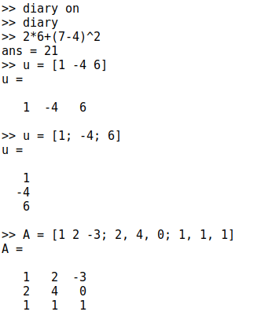
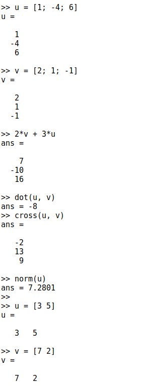
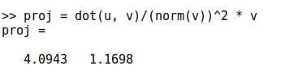
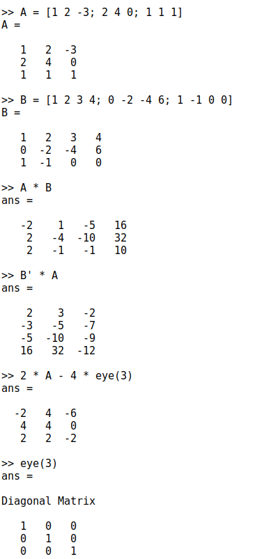
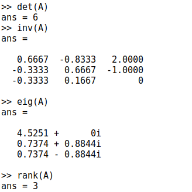
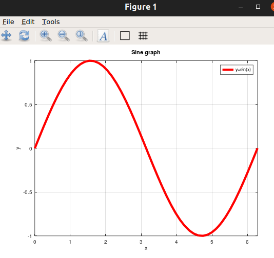
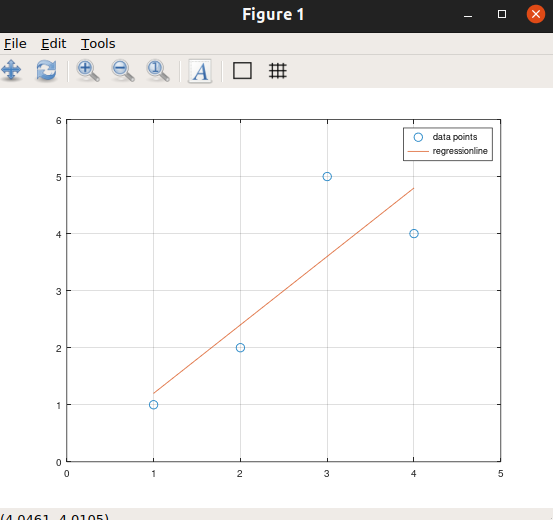
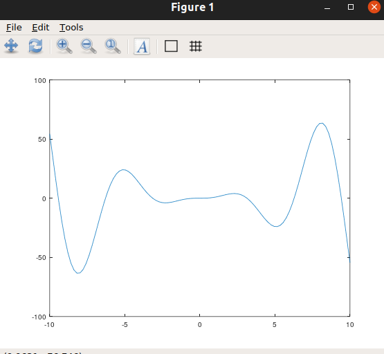
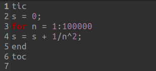
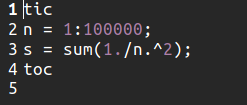

# Цель выполнения Лабораторной работы 3

- Введение в работу с Octave

# Простейшие операции

1 Включил журналирование сессии, с помощью команды diary on
2 Octave можно использовать как простейший калькулятор. Вычислил выражение
3 Задал вектор-строку(ковектор)
4 Задал вектор-столбец(вектор)
5 Задал матрицу

# Операции с векторами
1 Задал два вектора-столбца.
2 Операция сложения векторов
3 Скалярное умножение векторов
4 Векторное умножение векторов
5 Норма вектора

# Вычисление проетора
1 Ввел два вектора строки
2 Вычислил проекцию вектора u на вектор v

# Матричные операции
1 Ввел матрицы А и В
2 Вычислил произведение матриц АВ
3 Вычислил произведение матриц В^T*A
4 Вычислил 2А - 4I
5 Нашел определитель |A|
6 Нашел обратную матрицу A^-1
7 Нашел собственные значения матрицы А
8 Нашел ранг матрицы А

# Построение графиков
1 Создал вектор значений х
2 Задал вектор y = sin(x)
3 Построил график
 
4 Улучшил внешний вид графика.
5 Задал красный цвет для линии и сделал ее потолще
6 Подогнал диапазон осей
7 Нарисовал сетку
8 Подписал оси
9 Сделал заголовок графика
10 Задал легенду. В результате получился такой график:
 

# Два графика на одном чертеже

1 Очистил память и рабочую область фигуры
2 Задал два вектора
3 Начертил эти точки, использую кружочки как маркеры
4 Чтобы добавить в нашему текущему графику еще одие, использовал команду hold on
5 Добавил график регрессии
6 Задал сетку, оси и легенду. В результате получился график:
 

# График y = x^2*sin*x

1 Очистил память и рабочую область фигуры
2 Задал вектор х
3 Построил график y = x^2*sin*x
4  Построил график 𝑦 = 𝑥^2
sin 𝑥, используя поэлементное возведение в степень .^
и поэлементное умножение .*
5 Сохранил графики в виде файлов. 
6 В результате получился следующий график
 

# Сравнение циклов и операций с векторами

1 Очистил память и рабочую область фигуры
2 Вычислил сумму с помощью цикла Создав файл loop_for.m 
И записал в файл следующий цикл
  
Запустил файл с помощью команды loop_for, и получил результат: Elapsed time is 0.151193 seconds.
4 Вычислил сумму с помощью операций с векторами. Создал файл loop_vec.m и записал следующее
 
5 Запустил файл loop_vec и получил результат: Elapsed time is 0.0125811 seconds.

# Вывод 

Научился работать с Octave

А подробный текст операций можно увидеть в файле diaty, который будет загружен на GitHub