---
# Front matter
title: "Шаблон отчёта по лабораторной работе"
subtitle: "Простейший вариант"
author: "Турсунов Баходурхон Азимджонович"

# Generic otions
lang: ru-RU
toc-title: "Содержание"

# Bibliography
bibliography: bib/cite.bib
csl: pandoc/csl/gost-r-7-0-5-2008-numeric.csl

# Pdf output format
toc: true # Table of contents
toc_depth: 2
lof: true # List of figures
lot: true # List of tables
fontsize: 12pt
linestretch: 1.5
papersize: a4
documentclass: scrreprt
## I18n
polyglossia-lang:
  name: russian
  options:
	- spelling=modern
	- babelshorthands=true
polyglossia-otherlangs:
  name: english
### Fonts
mainfont: PT Serif
romanfont: PT Serif
sansfont: PT Sans
monofont: PT Mono
mainfontoptions: Ligatures=TeX
romanfontoptions: Ligatures=TeX
sansfontoptions: Ligatures=TeX,Scale=MatchLowercase
monofontoptions: Scale=MatchLowercase,Scale=0.9
## Biblatex
biblatex: true
biblio-style: "gost-numeric"
biblatexoptions:
  - parentracker=true
  - backend=biber
  - hyperref=auto
  - language=auto
  - autolang=other*
  - citestyle=gost-numeric
## Misc options
indent: true
header-includes:
  - \linepenalty=10 # the penalty added to the badness of each line within a paragraph (no associated penalty node) Increasing the value makes tex try to have fewer lines in the paragraph.
  - \interlinepenalty=0 # value of the penalty (node) added after each line of a paragraph.
  - \hyphenpenalty=50 # the penalty for line breaking at an automatically inserted hyphen
  - \exhyphenpenalty=50 # the penalty for line breaking at an explicit hyphen
  - \binoppenalty=700 # the penalty for breaking a line at a binary operator
  - \relpenalty=500 # the penalty for breaking a line at a relation
  - \clubpenalty=150 # extra penalty for breaking after first line of a paragraph
  - \widowpenalty=150 # extra penalty for breaking before last line of a paragraph
  - \displaywidowpenalty=50 # extra penalty for breaking before last line before a display math
  - \brokenpenalty=100 # extra penalty for page breaking after a hyphenated line
  - \predisplaypenalty=10000 # penalty for breaking before a display
  - \postdisplaypenalty=0 # penalty for breaking after a display
  - \floatingpenalty = 20000 # penalty for splitting an insertion (can only be split footnote in standard LaTeX)
  - \raggedbottom # or \flushbottom
  - \usepackage{float} # keep figures where there are in the text
  - \floatplacement{figure}{H} # keep figures where there are in the text
---
# Выполнение 4 лабораторной работы

## Метод Гаусса

1. Для системы линейных уравнений *Ax = b* построил расширенную матрицу вида *B = [A|b]*

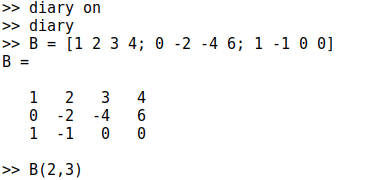(Рис 1)

2. Ее можно просматривать поэлементарно:

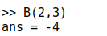(Рис 2)

 Это скаляр, хранящийся в строке 2, столбце 3.

3. Мы также можем извлечь целый вектор строки или вектор столбца, используя оператор сечения :. Сечение можно использовать для указания ограниченного диапазона. Если не указано нчальное или конечное значение, то результатом оператора является полный диапазон. Например:

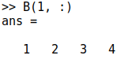(Рис 3)

 Получили первый ряд.

4. Теперь Реализовал явный метод Гаусса. Сначала добавил к третьей строке первую строку, умноженную на -1:

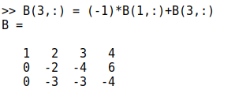(Рис 4)

5. Далее добавил к третьей строке вторую строку, умноженную на -1.5:

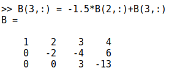(Рис 5)

6. Octave распологает встроенной командой для непосредственного поиска треугольной формы матрицы:

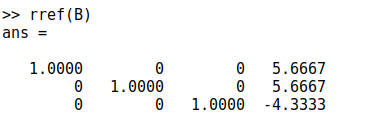(Рис 6)

## Левое деление

1. Встроенная операция для решения линейных систем вида *Ax = b* В Octave называется левым делением и записывается как *A \ b*. Это концептуально эквивалентно выражению $A^-1b$. ВЫделил из расширенной матрицы В матрицу А:

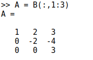(Рис 7)

и вектор b:

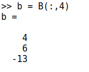(Рис 8)

После найдем вектор *x*:

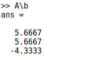(Рис 9)

## LUP-разложение

- LUP-разложение вычисляется в OCtave с помощью команды *[L U P] = lu (A)*

1. Пусть задана матрица А, с помощью команды *[L U P] = lu (A)* мы нашли эти разложения

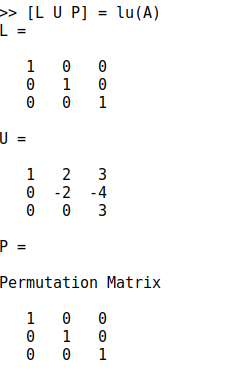(Рис 10)

## LU-разложение

1. Пусть также дана матрица А, и с помощью Octave расписал ее LU-разложение

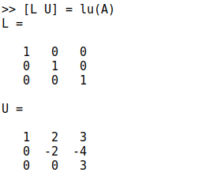(Рис 11)

# Вывод

Научился решать систему линейных уравнений с помощью Octave

