---
# Front matter
title: "Шаблон отчёта по лабораторной работе"
subtitle: "Простейший вариант"
author: "Турсунов Баходурхон Азимджонович"

# Generic otions
lang: ru-RU
toc-title: "Содержание"

# Bibliography
bibliography: bib/cite.bib
csl: pandoc/csl/gost-r-7-0-5-2008-numeric.csl

# Pdf output format
toc: true # Table of contents
toc_depth: 2
lof: true # List of figures
lot: true # List of tables
fontsize: 12pt
linestretch: 1.5
papersize: a4
documentclass: scrreprt
## I18n
polyglossia-lang:
  name: russian
  options:
	- spelling=modern
	- babelshorthands=true
polyglossia-otherlangs:
  name: english
### Fonts
mainfont: PT Serif
romanfont: PT Serif
sansfont: PT Sans
monofont: PT Mono
mainfontoptions: Ligatures=TeX
romanfontoptions: Ligatures=TeX
sansfontoptions: Ligatures=TeX,Scale=MatchLowercase
monofontoptions: Scale=MatchLowercase,Scale=0.9
## Biblatex
biblatex: true
biblio-style: "gost-numeric"
biblatexoptions:
  - parentracker=true
  - backend=biber
  - hyperref=auto
  - language=auto
  - autolang=other*
  - citestyle=gost-numeric
## Misc options
indent: true
header-includes:
  - \linepenalty=10 # the penalty added to the badness of each line within a paragraph (no associated penalty node) Increasing the value makes tex try to have fewer lines in the paragraph.
  - \interlinepenalty=0 # value of the penalty (node) added after each line of a paragraph.
  - \hyphenpenalty=50 # the penalty for line breaking at an automatically inserted hyphen
  - \exhyphenpenalty=50 # the penalty for line breaking at an explicit hyphen
  - \binoppenalty=700 # the penalty for breaking a line at a binary operator
  - \relpenalty=500 # the penalty for breaking a line at a relation
  - \clubpenalty=150 # extra penalty for breaking after first line of a paragraph
  - \widowpenalty=150 # extra penalty for breaking before last line of a paragraph
  - \displaywidowpenalty=50 # extra penalty for breaking before last line before a display math
  - \brokenpenalty=100 # extra penalty for page breaking after a hyphenated line
  - \predisplaypenalty=10000 # penalty for breaking before a display
  - \postdisplaypenalty=0 # penalty for breaking after a display
  - \floatingpenalty = 20000 # penalty for splitting an insertion (can only be split footnote in standard LaTeX)
  - \raggedbottom # or \flushbottom
  - \usepackage{float} # keep figures where there are in the text
  - \floatplacement{figure}{H} # keep figures where there are in the text
---

# Выполнение 5 лабораторной работы

## Подгонка полиномиальной кривой

1. В статистике часто рассматривается проблема подгонки прямой линии
к набору данных. Решим более общую проблему подгонки полинома к
множеству точек. Пусть нам нужно найти параболу по методу наименьших
квадратов для набора точек, заданных матрицей.
В матрице заданы значения 𝑥 в столбце 1 и значения 𝑦 в столбце 2.
Введём матрицу данных в Octave и извлечём вектора 𝑥 и 𝑦.

После рисуем точки графике. Результат (Рис 1)

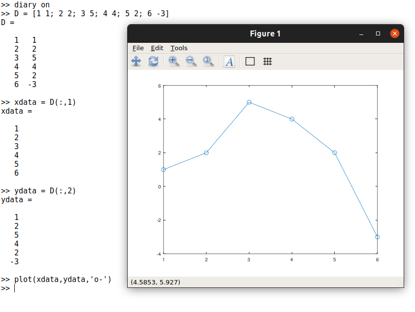(Рис 1)

2. Далее с помощью команды *ones* создаем еденичную матрицу соответствующего размера, а затем переписываем первый и второй столбцы необходимыми данными:

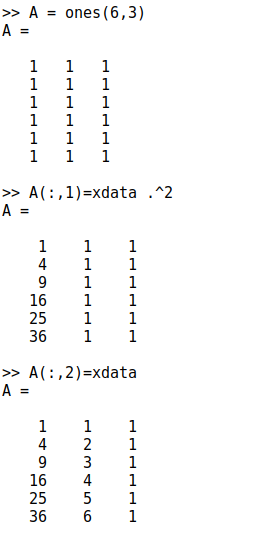(Рис 2)

3. Решение по методу наименьших квадратов получается из решения уравнения(Рис 3)

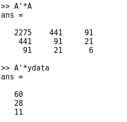(Рис 3)

4. Решим задачу методом Гаусса. Запишем расширенную матрицу:

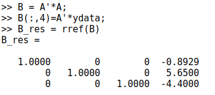(Рис 4)

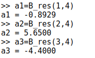(Рис 5)

5. Таким образом, искомое квадратное уравнение имеет вид
𝑦 = −0.89286x2 + 5.65x − 4.4.
Построим соответствующий график параболы.

В итоге получили подобный граф

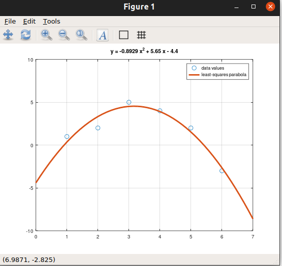(Рис 6)

6. Процесс подгонки может быть автоматизирован встроенными функциями Octave. Для этого мы можем использовать встроенную функцию
для подгонки полинома polyfit. Синтаксис: polyfit (x, y, order),
где order – это степень полинома. Значения полинома P в точках, задаваемых вектором-строкой x можно получить с помощью функции polyval.
Синтаксиса: polyval (P, x).
Получим подгоночный полином.

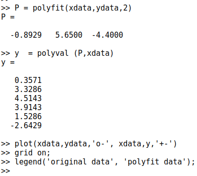(Рис 7)

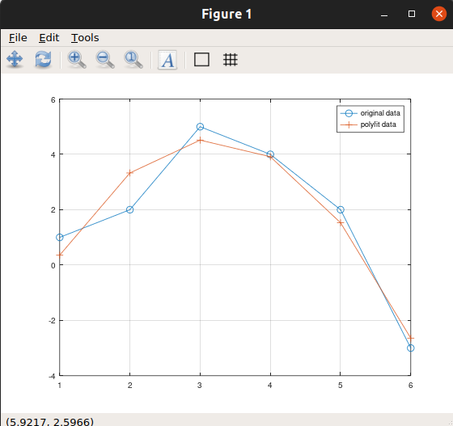(Рис 8)

## Матричные преобразования

1. Матрицы и матричные преобразования играют ключевую роль в компьютерной графике. Существует несколько способов представления изображения в виде матрицы. Подход, который мы здесь используем, состоит в
том, чтобы перечислить ряд вершин, которые соединены последовательно,
чтобы получить ребра простого графа. Мы записываем это как матрицу 2 × 𝑛, где каждый столбец представляет точку на рисунке. В качестве простого примера, давайте попробуем закодировать граф-домик. Есть много
способов закодировать это как матрицу. Эффективный метод состоит в
том, чтобы выбрать путь, который проходит по каждому ребру ровно один
раз (цикл Эйлера).

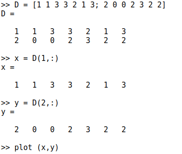(Рис 8)

В итоге получился такой граф (Рис 9)

(Рис 9)

## Вращение

1. В этом пункте мы попробуем повернуть граф дома на 90 и 225 градусов. Вначале переведем угол в радианы

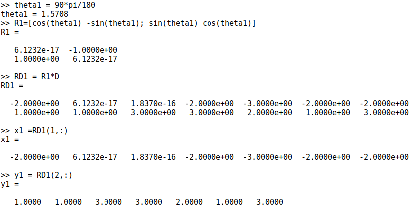(Рис 10)

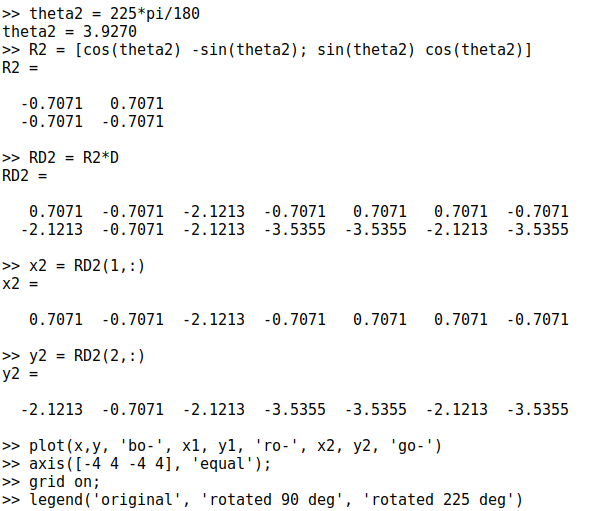(Рис 11)

В результате получился такой вид графа(Рис 12)

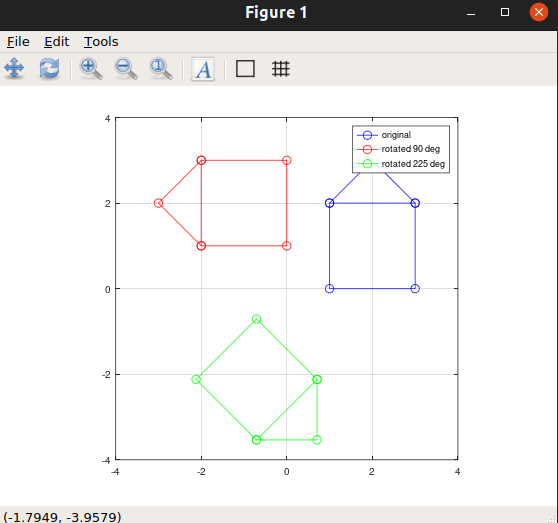(Рис 12)

## Отражение

### Диллатация 

1. В этом пункте мы отразим граф дома относительно прямой *y = x*. Зададим матрицу отражения. И сразу увеличиваем размеры дома в два раза

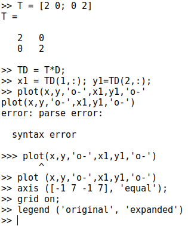(Рис 13)

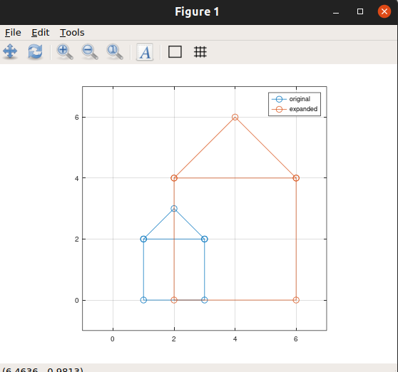(Рис 13)

Такой граф получился, потому что, точки x и y соприкасаются друг с другом.

# Вывод 

Научился подгонять полиномиальные кривые

