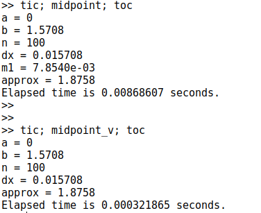

---
# Front matter
title: "Шаблон отчёта по лабораторной работе"
subtitle: ""
author: "Турсунов Баходурхон Азимджонович"

# Generic otions
lang: ru-RU
toc-title: "Содержание"

# Bibliography
bibliography: bib/cite.bib
csl: pandoc/csl/gost-r-7-0-5-2008-numeric.csl

# Pdf output format
toc: true # Table of contents
toc_depth: 2
lof: true # List of figures
lot: true # List of tables
fontsize: 12pt
linestretch: 1.5
papersize: a4
documentclass: scrreprt
## I18n
polyglossia-lang:
  name: russian
  options:
	- spelling=modern
	- babelshorthands=true
polyglossia-otherlangs:
  name: english
### Fonts
mainfont: PT Serif
romanfont: PT Serif
sansfont: PT Sans
monofont: PT Mono
mainfontoptions: Ligatures=TeX
romanfontoptions: Ligatures=TeX
sansfontoptions: Ligatures=TeX,Scale=MatchLowercase
monofontoptions: Scale=MatchLowercase,Scale=0.9
## Biblatex
biblatex: true
biblio-style: "gost-numeric"
biblatexoptions:
  - parentracker=true
  - backend=biber
  - hyperref=auto
  - language=auto
  - autolang=other*
  - citestyle=gost-numeric
## Misc options
indent: true
header-includes:
  - \linepenalty=10 # the penalty added to the badness of each line within a paragraph (no associated penalty node) Increasing the value makes tex try to have fewer lines in the paragraph.
  - \interlinepenalty=0 # value of the penalty (node) added after each line of a paragraph.
  - \hyphenpenalty=50 # the penalty for line breaking at an automatically inserted hyphen
  - \exhyphenpenalty=50 # the penalty for line breaking at an explicit hyphen
  - \binoppenalty=700 # the penalty for breaking a line at a binary operator
  - \relpenalty=500 # the penalty for breaking a line at a relation
  - \clubpenalty=150 # extra penalty for breaking after first line of a paragraph
  - \widowpenalty=150 # extra penalty for breaking before last line of a paragraph
  - \displaywidowpenalty=50 # extra penalty for breaking before last line before a display math
  - \brokenpenalty=100 # extra penalty for page breaking after a hyphenated line
  - \predisplaypenalty=10000 # penalty for breaking before a display
  - \postdisplaypenalty=0 # penalty for breaking after a display
  - \floatingpenalty = 20000 # penalty for splitting an insertion (can only be split footnote in standard LaTeX)
  - \raggedbottom # or \flushbottom
  - \usepackage{float} # keep figures where there are in the text
  - \floatplacement{figure}{H} # keep figures where there are in the text
---

# Выполнение 6 лабораторной работы

## Пределы, последовательности и ряды

- Octave - полноценный язык программирования, поддерживающий множество типов циклов и условных операторов.

- Расспишем простую функцию:

(Рис 1)

- метод которую я использовал здесь называется анонимной функцией. Это хороший способ быстро определить простую функцию

1. Далее создал индексную переменную, состоящую из целых чисел от 0 до 9

(Рис 2)

- синтаксис [0:1:9] создает вектор строки, который начинается с 0 и увеличивается с шагом от 1 до 9. Обратите внимание, что мы использовали операцию транспонирования просто потому что, наши результаты будут легче читать как векторы столбцы. Теперь мы возьмем степени 10, которые буду входными значениями, а затем оценим f(n).:

(Рис 3)

- Предел сходится к конечному значение, которое составляет приблизительно 2,71828... Подобные методы могут быть использованы для численного исследования последовательностей и рядов.

## Частичные суммы

1. Определим индексный вектор n от 2 до 11, а затем вычислим члены.

(Рис 4)

2. Если мы хотим знать частичную сумму, нам нужно написать *sum(a)*. Если мы хотим получить последовательность частичных сумм, нам нужно использовать цикл. Мы будем использовать цикл for с индексом *i* от 1 до 10. Для каждошо *i* мы получим частичную сумму последовательности *an* от первого слагаемого до *i*-го слагаемого. На выходе получается 10-элементный вектор этих частичных сумм.

(Рис 5)

(Рис 6)

## Сумма ряда

1. Найдем сумму первых 1000 членов гармоничного ряда.
Нам нужно сгенерировать чекы как ряда вектор, а затем взять их сумму.

(Рис 6)

## Численное интегрирование

### Вычисление интегралов

- Octave имеет несколько встроенных функций для вычисления определенных интегралов. Мы будем использовать команду quad(сокращение от слова квадратура).

1. Определяем функцию, чей интеграл мы будем считать, и считаем определенный интеграл командой quad.

(Рис 7)

## Аппроксимирование суммами

1. Создал файл midpoint.m и записал туда код

(Рис 8)

2. Запустил файл и вот результат:

(Рис 9)

3. Далее создал еще один файл с название midpoint_v.m и записал туда код:

(Рис 10)

4. Результат:

(Рис 11)

5. Сравнил результаты выполнения каждой реализации:

(Рис 12)

# Вывод 

В ходе выполнения работы я научился считать пределы и частичные суммы рядов, считать определенный интеграл встроенной окмандой quad и методом средней точки, а так же увидел разницу в скорости работы трандиционного кода (с циклами) и векторизированного кода.