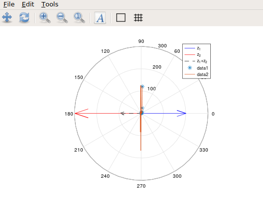
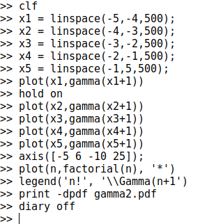

---
# Front matter
title: "Шаблон отчёта по лабораторной работе"
subtitle: "Простейший вариант"
author: "Турсунов Баходурхон Азимджонович"

# Generic otions
lang: ru-RU
toc-title: "Содержание"

# Bibliography
bibliography: bib/cite.bib
csl: pandoc/csl/gost-r-7-0-5-2008-numeric.csl

# Pdf output format
toc: true # Table of contents
toc_depth: 2
lof: true # List of figures
lot: true # List of tables
fontsize: 12pt
linestretch: 1.5
papersize: a4
documentclass: scrreprt
## I18n
polyglossia-lang:
  name: russian
  options:
	- spelling=modern
	- babelshorthands=true
polyglossia-otherlangs:
  name: english
### Fonts
mainfont: PT Serif
romanfont: PT Serif
sansfont: PT Sans
monofont: PT Mono
mainfontoptions: Ligatures=TeX
romanfontoptions: Ligatures=TeX
sansfontoptions: Ligatures=TeX,Scale=MatchLowercase
monofontoptions: Scale=MatchLowercase,Scale=0.9
## Biblatex
biblatex: true
biblio-style: "gost-numeric"
biblatexoptions:
  - parentracker=true
  - backend=biber
  - hyperref=auto
  - language=auto
  - autolang=other*
  - citestyle=gost-numeric
## Misc options
indent: true
header-includes:
  - \linepenalty=10 # the penalty added to the badness of each line within a paragraph (no associated penalty node) Increasing the value makes tex try to have fewer lines in the paragraph.
  - \interlinepenalty=0 # value of the penalty (node) added after each line of a paragraph.
  - \hyphenpenalty=50 # the penalty for line breaking at an automatically inserted hyphen
  - \exhyphenpenalty=50 # the penalty for line breaking at an explicit hyphen
  - \binoppenalty=700 # the penalty for breaking a line at a binary operator
  - \relpenalty=500 # the penalty for breaking a line at a relation
  - \clubpenalty=150 # extra penalty for breaking after first line of a paragraph
  - \widowpenalty=150 # extra penalty for breaking before last line of a paragraph
  - \displaywidowpenalty=50 # extra penalty for breaking before last line before a display math
  - \brokenpenalty=100 # extra penalty for page breaking after a hyphenated line
  - \predisplaypenalty=10000 # penalty for breaking before a display
  - \postdisplaypenalty=0 # penalty for breaking after a display
  - \floatingpenalty = 20000 # penalty for splitting an insertion (can only be split footnote in standard LaTeX)
  - \raggedbottom # or \flushbottom
  - \usepackage{float} # keep figures where there are in the text
  - \floatplacement{figure}{H} # keep figures where there are in the text
---

# Выполнение седьмой лабораторной работы

# Цель работы 

Научиться работать с графиками и комплексными числами 

# Задание работы

Изучить построение параметрических графиков, графиков в полярных координатах, графиков неявных функций и графиков гамма-функций, а также научиться работать с комплексными числами. 

# Ход работы

# Графики

## Параметричские графики

1. Я построил параметрические уравнения для циклоиды и сохранил их в форматах pdf и png

(Рис 1)

- В результате вычислений получился такой график:

(Рис 2)

## Полярные координаты 

1. Я построил улитку Паскаля

(Рис 3)

- В результате получился граф:

(Рис 4)

2 Также можно построить функцию в полярных осях, используя команду *polar*

(Рис 5)

- В результате получился такой граф

(Рис 6)

## Графики неявных функций

1. Задал функцию в Лямбда-функции и построил график:

(Рис 7)

(Рис 8)

2. Далее нашел уравнение касательной к графику окружности в точке (-1,4)

(Рис 9)

- Центр круга находился в точке(2,0), а радиус был равен пяти. Поэтому задал оси нашего графика так, чтобы они несколько раз превосходили окружность:

(Рис 10)

2. Далее построил график

(Рис 11)

Результат:

(Рис 12)

## Комплексные числа

1. Записал основные арифметические операции с числами

(Рис 13)

2. Создал график используя команду **compass**

(Рис 14)

Результат:

(Рис 16)

## Специальные функции

1. Я построил график гамма-функции.

(Рис 16)

- Результат:

(Рис 18)

2. Для более точных вычислений мы должны разделить область значений на отдельные интервалы, это дает более точный график.

(Рис 19)

- Результат:

(Рис 20)

# Вывод

В ходе выполнения данной лабораторной работы я научился строить параметрические графики, графики в полярных координатах, графики неявных функций и графики гамма-функций, а также научился работать с комплексными числами в Octave.